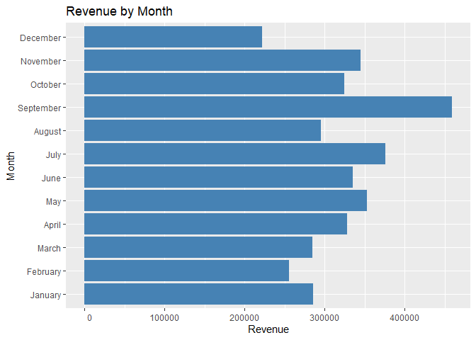

ecom2
================
2024-01-02

\##Importing the dataset

``` r
retailsales <- read.csv("eCommerce Dataset - data.csv")
```

\##Getting to know the data

``` r
glimpse(retailsales)
```

    ## Rows: 541,909
    ## Columns: 8
    ## $ InvoiceNo   <chr> "536365", "536365", "536365", "536365", "536365", "536365"…
    ## $ StockCode   <chr> "85123A", "71053", "84406B", "84029G", "84029E", "22752", …
    ## $ Description <chr> "WHITE HANGING HEART T-LIGHT HOLDER", "WHITE METAL LANTERN…
    ## $ Quantity    <int> 6, 6, 8, 6, 6, 2, 6, 6, 6, 32, 6, 6, 8, 6, 6, 3, 2, 3, 3, …
    ## $ InvoiceDate <chr> "12/1/2010 8:26", "12/1/2010 8:26", "12/1/2010 8:26", "12/…
    ## $ UnitPrice   <dbl> 2.55, 3.39, 2.75, 3.39, 3.39, 7.65, 4.25, 1.85, 1.85, 1.69…
    ## $ CustomerID  <int> 17850, 17850, 17850, 17850, 17850, 17850, 17850, 17850, 17…
    ## $ Country     <chr> "United Kingdom", "United Kingdom", "United Kingdom", "Uni…

``` r
head(retailsales)
```

    ##   InvoiceNo StockCode                         Description Quantity
    ## 1    536365    85123A  WHITE HANGING HEART T-LIGHT HOLDER        6
    ## 2    536365     71053                 WHITE METAL LANTERN        6
    ## 3    536365    84406B      CREAM CUPID HEARTS COAT HANGER        8
    ## 4    536365    84029G KNITTED UNION FLAG HOT WATER BOTTLE        6
    ## 5    536365    84029E      RED WOOLLY HOTTIE WHITE HEART.        6
    ## 6    536365     22752        SET 7 BABUSHKA NESTING BOXES        2
    ##      InvoiceDate UnitPrice CustomerID        Country
    ## 1 12/1/2010 8:26      2.55      17850 United Kingdom
    ## 2 12/1/2010 8:26      3.39      17850 United Kingdom
    ## 3 12/1/2010 8:26      2.75      17850 United Kingdom
    ## 4 12/1/2010 8:26      3.39      17850 United Kingdom
    ## 5 12/1/2010 8:26      3.39      17850 United Kingdom
    ## 6 12/1/2010 8:26      7.65      17850 United Kingdom

## Top 5 rows of the data

``` r
head(retailsales,5)
```

    ##   InvoiceNo StockCode                         Description Quantity
    ## 1    536365    85123A  WHITE HANGING HEART T-LIGHT HOLDER        6
    ## 2    536365     71053                 WHITE METAL LANTERN        6
    ## 3    536365    84406B      CREAM CUPID HEARTS COAT HANGER        8
    ## 4    536365    84029G KNITTED UNION FLAG HOT WATER BOTTLE        6
    ## 5    536365    84029E      RED WOOLLY HOTTIE WHITE HEART.        6
    ##      InvoiceDate UnitPrice CustomerID        Country
    ## 1 12/1/2010 8:26      2.55      17850 United Kingdom
    ## 2 12/1/2010 8:26      3.39      17850 United Kingdom
    ## 3 12/1/2010 8:26      2.75      17850 United Kingdom
    ## 4 12/1/2010 8:26      3.39      17850 United Kingdom
    ## 5 12/1/2010 8:26      3.39      17850 United Kingdom

\#Running summarises of the dataset

``` r
#Removing possible duplicates

retailsales2 <- unique(retailsales)

#Noticed null values in the Customer ID column during exploration, removing them

retailsales2 <- na.omit(retailsales2, select = c("CustomerID"))
```

\###Noticed null values in the Customer ID column during exploration,
removing them

``` r
retailsales2 <- na.omit(retailsales2, select = c("CustomerID"))
```

\#Converting the date column from character format to a date time format

``` r
str(retailsales2$InvoiceDate) #Confirming the 'InvoiceDate' column has changed to date time format
```

    ##  chr [1:401604] "12/1/2010 8:26" "12/1/2010 8:26" "12/1/2010 8:26" ...

``` r
glimpse(retailsales2$InvoiceDate)
```

    ##  chr [1:401604] "12/1/2010 8:26" "12/1/2010 8:26" "12/1/2010 8:26" ...

``` r
retailsales2$InvoiceDate <- as.Date(retailsales2$InvoiceDate)
```

``` r
#The cancelled order contain an 'InvoiceNo' that begins with a 'C', we won't be needing those for this analysis as our focus are our most valuable customers

retailsales2 <- retailsales2[!grepl("^C", retailsales2$InvoiceNo), ]
head(retailsales2$InvoiceNo)
```

    ## [1] "536365" "536365" "536365" "536365" "536365" "536365"

\###The cancelled order contain an ‘InvoiceNo’ that begins with a ‘C’,
we won’t be needing those for this analysis as our focus are our most
valuable customers

``` r
#Dropping the 'StockCode,' and 'Description' column as they won't be necessary for the analysis

retailsales2 <- retailsales2 %>%  
  select(-c( StockCode,Description))

#The cancelled order contain an 'InvoiceNo' that begins with a 'C', we won't be needing those for this analysis as our focus are our most valuable customers

retailsales2 <- retailsales2[!grepl("^C", retailsales2$InvoiceNo), ]
head(retailsales2$InvoiceNo)
```

    ## [1] "536365" "536365" "536365" "536365" "536365" "536365"

\##Exploratory data analysis

\###Calculating the revenue and including a revenue column

``` r
#retailsales2$revenue <- paste0("?", formatC(retailsales2$revenue, format = "f", digits = 2, big.mark = ","))
#glimpse(retailsales2$revenue)

retailsales2$revenue <- retailsales2$Quantity * retailsales2$UnitPrice
head(retailsales2$revenue)
```

    ## [1] 15.30 20.34 22.00 20.34 20.34 15.30

\#Extracting month from the ’InovoiceDate’column

``` r
library(tidyr)
retailsales3<-retailsales2 %>% 
              
                      mutate(InvoiceDate = as_datetime(InvoiceDate), month_col=month(InvoiceDate,label = TRUE,abbr=FALSE), sort_mnt  =month(InvoiceDate)) %>% 
 drop_na()


ggplot(retailsales3, aes(x = month_col, y = revenue)) +
  geom_bar(stat = "identity", fill = "steelblue") +
  labs(x = "Month", y = "Revenue", title = "Revenue by Month")+
  scale_y_continuous(labels = function(x) format(x, scientific = FALSE))+ coord_flip()  # Formatting y-axis labels
```

<!-- -->
